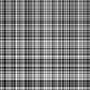
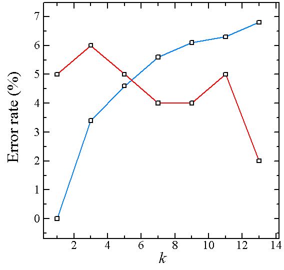
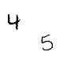
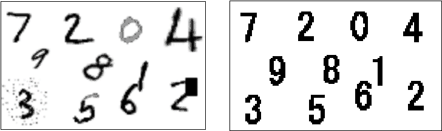

# 手書き数字認識の演習

## 準備

### Step 0:

- 準備として簡単な例題を解くことでプログラムの基本を復習しよう．
- 以下の問題を番号順に解いて行こう．
- このとき一挙に全てを解こうとしないで，一つ一つ確実に解いていくことを心がけよう．

#### Step 0-1:

- 自分の名前を標準出力関数(`printf` (C), `print` (Python))を使って表示せよ．
- 自分の名前をループを使って $100$ 回表示せよ．
- 上記の問題において，名前の前に何回目のループでの表示か分るようにループの回数を表示せよ．
- 上記の問題において，奇数番目のループの時だけ名前を表示するようにせよ．

#### Step 0-2

- $1$ から $100$ までの総和を求めるプログラムを書け．
- 上で求めた総和を $3$ で割った値を小数点 $3$ 桁まで求めよ．

#### Step 0-3

- 要素数が $100$ の $1$ 次元配列を用意し， `i` 番目の要素に `1` から `i` までの総和を代入せよ．
- $10\times 10$ の $2$ 次元配列を用意し，その `(i , j)` 要素を $$\sum_{p=0}^{i}\sum_{q=0}^{j}pq$$ とせよ．

#### Step 0-4

- 一様分布に基づく乱数を $10$ 個生成せよ(参考:[C](./sample_codes/clang/start1.c), [Python](./sample_codes/python/start1.py))．
- 上記の問題で生成した乱数を大きい順に並べて表示するプログラムを作れ．

## 画像の入出力からkNN識別まで

### Step1:

- 画像処理とプログラミングの復習：
  - まずは[演習用画像](./figs/admix.pgm)をダウンロードし，画像閲覧ソフトで見てみよう．
  - この画像を見ると，明るい画素と暗い画素が交互に混ざりあっているのがわかる．
  - そこで暗い画素が上に，明るい画素が下になるように画素を並び替えた画像を作成してみよう
  - （すなわち[このような画像](./figs/step1.png)を作成してください）．
    - 

  [演習用画像](./figs/adminx.pgm)
  - （画像サイズは $128\times 128$ ）

  > モノクロ画像についての解説ページ：[モノクロ画像の入出力](./grayimage-io/Readme.md)

  > [サンプル画像：Lenna.pgm](./figs/Lenna.pgm)
  > - 


### Step2:

- 複数の画像を読み込むプログラムを作ることを考える．
- ここでは実際に数字パターンを $100$ 枚読み込んでみる．
- 準備として以下のファイルをダウンロードしよう．

  [100枚の手書き数字の画像データ](./datasets/MNIST/test100/images.zip)

- ダウンロードしたら複数の画像データをプログラムによって読み込み，各画像の画素値を配列に格納するプログラムを作成しよう（画像サイズは $28\times 28$）．

  - [`sprintf`関数を使って画像ファイルを順番に開くプログラムのサンプル（C)](./sample_codes/clang/C5.c)
  - $100$ 枚の画像ファイルを配列に展開するプログラム(C)：[fileread_test.c](./sample_codes/fileread_test.c)

### Step3:

- Step2により $100$ 枚の手書き数字画像を開いて配列に格納することができたら，画像間のユークリッド距離を計算しよう．画像間のユークリッド距離は以下のようにして計算します．

  - 画素数が $m\times n=d$ の手書き数字画像データが全部で $N$ 個あるとする．
  - 第 $i$ 番目の画像データを $1$ 次元ベクトルで表現したものを $$\bm{x}_{i} = \left[ x_{(i,~1)} & \dots & x_{(i,~d)}\right]^\top \quad (i=1,\dots ,N)$$ と書く．
  - このとき，画像の文字部分（黒）が $1$ ，背景部分（白）が $0$ となるように画素値を変換しておく．
  - さらに画素値の総和が $1$ となるように $$\sum_{k=1}^{d} x_{(i,k)}=1$$ と規格化する．
  - 画像 $i$ と $j$ とのユークリッド距離は $$\lvert \bm{x}_i - \bm{x}_j \rvert = \sqrt{ \sum_{k=1}^{d} (x_{(i,k)} - x_{(j,k)})^2 }$$ により計算される．
  - 2つの画像（ベクトル）が似ているほど，この距離値は小さくなる．

> ### sample1. （1枚目の画像とその他の画像の間の距離を計算して表示するプログラム：[dist_sample1.c](./sample_codes/clang/dist_sample1.c)）
> > $100$ 枚の文字画像を用いて、画像間の距離値を計算できるようにする。
> - 画像の黒が $1$ 、白が $0$ となるように、画素値を変換する。
> - 画素値の総和が $1$ となるように規格化する。
> - 画像間のユークリッド距離を計算する。
> - $100$ 枚の画像(No. $1$ ～No. $100$ )を用いて、以下を表示してみる。
>
> ```
> 「No.1とNo.2 の距離」
> 「No.1とNo.3 の距離」
> 「No.1とNo.4 の距離」 ・・・
> ```

> ### sample2 （画像間の距離と同時に画像のラベルを表示するプログラム：[dist_sample2.c](./sample_codes/clang/dist_sample2.c)）
> > $100$ 枚の文字画像に対するラベル（どの数字が書かれているかを示す情報）を読み込み、 プログラム中で利用できるようにする。
> - [$100$ 枚の文字画像に対するラベルファイル](./datasets/MNIST/test100/label.txt) をホームページのStep5の 部分からダウンロードしておく。
> - プログラム中で、文字画像に加えてラベルファイルを読み込む。
> - 上記２で作成したプログラムにおいて、対象とした画像が何という数字であるかを 距離と同時に表示するように改変する。

### Step4:

- 未知の手書き数字データが与えられたときに，その数字が何の数字なのか識別することを考える．
- まず，パターン認識の基本を復習しよう．

  「わかりやすいパターン認識（第2版），石井ほか，オーム社（2019）」第1章([pdf](pattern_recognition_intro.pdf))

### Step5:

- 識別法のうち，最近傍法（NN法）とk近傍法（k-NN法）について実際にプログラムを作成して，手書き数字を識別しよう．
- $2000$ 枚の学習データを用いて，まず $100$ 枚のテストデータを識別しよう．
- さらに $1000$ 枚のテストデータを識別して正答率を算出してみよう．

  > $2000$ 枚の学習データ（training data）：
  > - 画像:[pgm](./datasets/MNIST/train2000/images.zip)
  > - ラベル：[txt](./datasets/MNIST/train2000/label.txt)

  > $100$ 枚のテストデータ（test data）：
  > - 画像:[pgm](./datasets/MNIST/test100/images.zip)
  > - ラベル：[txt](./datasets/MNIST/test100/label.txt)

  > $1000$ 枚のテストデータ（test data 1000）：
  > - 画像:[pgm](./datasets/MNIST/test1000/images.zip)
  > - ラベル：[txt](./datasets/MNIST/test1000/label.txt)

  > C言語では，大きな配列を静的に確保しようとすると，コンパイル時または実行時にエラーとなる場合がある．そのときは，`malloc` (または`calloc`)を用いてメモリを動的に確保するとよい．
  >
  > $2000$ 枚の画像ファイルを`calloc`を使って確保した配列に展開するプログラム：[alloc_test.c](./sample_codes/clang/alloc_test.c)

> ### sample3（100枚のテストデータの１枚目と2000枚の学習データのそれぞれとの距離を計算して表示するプログラム：[dist_sample3.c](./sample_codes/clang/dist_sample3.c)）
> > $100$ 枚の文字画像（テストデータ）と同時に、 $2000$ 枚の文字画像（学習データ）と ラベルファイルを読み込む。
> - $2000$ 枚の文字画像をプログラムに読み込む。このとき、配列のためのメモリを 動的に確保する。
> - [$2000$ 枚の文字画像に対応するラベルファイル](./datasets/MNIST/train2000/label.txt)を読み込む。
> - テストデータの $1$ 枚目と $2000$ 枚の学習データとの距離値をそれぞれ計算して ラベルとともに表示する。

> ### sample4（100枚のテストデータの１枚目と2000枚の学習データのそれぞれとの距離を計算して小さい順に表示するプログラム：[dist_sample4.c](./sample_codes/clang/dist_sample4.c)）
>
> > $100$ 枚のテストデータの $1$ 枚目と、 $2000$ 枚の学習データとの距離値をそれぞれ計算して、 小さい順に表示する。
> - 距離値を計算して記憶しておく。
> - 距離値の小さい順にソートする。ラベルデータも同時にソートされるように工夫する。
> - $100$ 枚のテスト画像のそれぞれについて、距離値が最も小さいものを識別結果とする（NN法）。 結果をもとに，正答率を算出する．

- テストデータを $1000$ 枚に増やし，テスト画像のそれぞれについて、距離値が最も小さいものを識別結果とする。 結果をもとに，正答率を算出する．
- アルゴリズムを下記の $k$-近傍法（$k$-NN法）に変更して実験をおこなう． $k$ を変化させたときの 識別結果の違いを検討する．

## $k$ 近傍法（$k$-Nearest-Neighbor rule, $k$ NN）

1. テストデータを入力する．
2. テストデータとユークリッド距離が近い上位 $k$ 個の学習データを求める．
3. $k$ 個の学習データのラベルを調べ，もっとも多いラベルをテストデータのラベルとして出力する．

- このアルゴリズムで $k=1$ とすれば最近傍法になり， $2$ 以上の $k$ を使えば $k$ 近傍法になる．

### 参考資料

- 実験で用いているデータに $k$ 近傍法を適用した場合のテストデータに対するエラー率と，学習データに対するエラー率を下のグラフに示す．
- 横軸が $k$ 近傍法における $k$ ，縦軸がエラー率である．
- エラー率(%)とは $\frac{\text{（識別で正解したデータの個数）}}{\text{（識別の対象となったデータの総数）}}$ を100倍したものである．
- 赤がテストデータに対するエラー率，青が学習データに対するエラー率を示す．
- このエラー率の計算ではリジェクト（「わかりません」を出力することと同じ）は考慮されていない．



- 時間があれば，このグラフを[`gnuplot`](./gnuplot)で作成してみよう．

## 挑戦課題

### Step6:

- 今まで用いてきた数字データは数字の書かれている位置が決まっていた．
- そこで任意の位置にある数字を認識することを考えてみる．
- まず以下の[演習用画像2](./figs/step6.pgm)（画像サイズは $80\times 80$）をダウンロードしてみよ．
- そこに書かれている2つの数字を認識するにはどのようにすればよいか？
- 方針が決まったらプログラミングで実際に認識処理を行ってみよう．

[演習用画像2](./figs/step6.pgm)
- 

### Step7:

- 以下の [対象画像](./figs/contest.pgm)（画像サイズは $133\times 84$）から数字を探し出し，その数字が何であるのか出力するプログラムを作成してみよ．

（左）対象画像，（右）正解



補助プログラム
- [画像の拡大縮小と回転](./sample_codes/clang/rotation2.h)
- [サンプルプログラム](./sample_codes/clang/sample.c)
