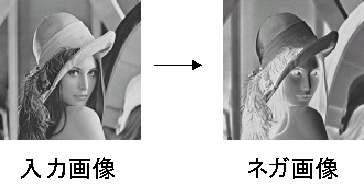
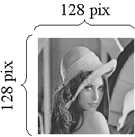
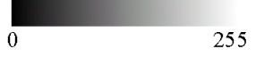
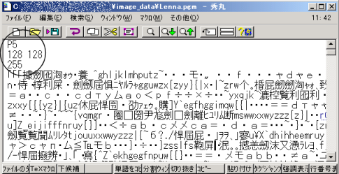
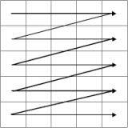

# 2.1 画像の入出力

> Q. モノクロ画像を入力して輝度（暗（黒）: $`0`$ 〜明（白）： $`255`$ ）を反転した画像（ネガ）を出力しなさい

入力画像の輝度を $`g`$ とすると各画素の強度を $`255-g`$ に入れ替えた画像を出力する．

## 簡単な復習

この演習を行う前に，モノクロ画像がどのような構造であるのか簡単に復習しよう．ダウンロードした画像データの中の `Lenna.pgm` を画像ビューワで開いて見よ．この画像のサイズは横 $`128`$ ピクセル，縦 $`128`$ ピクセルである．

モノクロ画像は輝度を強度に持った画素が並び集まったものである．輝度は $`0`$ から $`255`$ の $`256`$ 段階の値をとり，値が小さいほど暗く， $`255`$ は最も明るい．

> Q. ここで，`Lenna.pgm` の一番左上の輝度は $`137`$ であり，一番右下のグレイレベルが $`69`$ であることを画像ビューワを使って確認しなさい．

## モノクロ画像のフォーマット

ここではモノクロ画像ファイルの構造について簡単に説明する．

まず， `Lenna.pgm` をテキストエディタで開いてみよ．

すると下の図のような文字列が表示される．

最初の `P5，128 128，255` の部分(図中，円で囲んである部分)以外は，漢字や記号が並んでいる．

最初の `P5，128 128，255` のことを *画像のヘッダ* と呼ぶ．ヘッダは画像フォーマットごとに異なる．

この場合， `P5` は *画像の識別符号* と呼ばれるものであり，この画像はバイナリ形式の Portable GreyMap (pgmファイル)である，ということを示している．

`128 128` は画像の横，縦のサイズであり， `255` はこの画像の最大輝度である．

その後に続く記号のようなものが，各画素の輝度である．

ただし，バイナリ形式で書かれているため，漢字や記号等で表示される．

画像の各画素の輝度は左上から右下に向かって下の図のように，矢印の順に記述されている（ラスタスキャン）．

## ネガ画像の作成

この演習の目的は，画像の輝度を読み込んで輝度を反転してネガ画像を作り，それを画像ファイルとして書き出すことである．

注意したい点は，輝度を読み込む前にヘッダを取り除く作業と，ネガ画像を出力するときにヘッダを書き込む作業が必要であるということである．

サンプルプログラムとして，画像中の画素の座標とその輝度を表示するプログラムを掲載しておく．これを参考にして `Lenna.pgm` のネガ画像を作成してみよ．

[サンプルプログラム(C)](../sample_codes/clang/pgm_sample.c)

※注　このページに掲載されているサンプルプログラムは実験を行う上で必要最小限の記述しかされていない．これはプログラムをわかり易くするためであり，最適なプログラムとは言えない．したがって，誤った操作をすると画像ファイルが壊れる可能性がある．余裕がある場合，改良すべき部分を各自修正していって欲しい．
